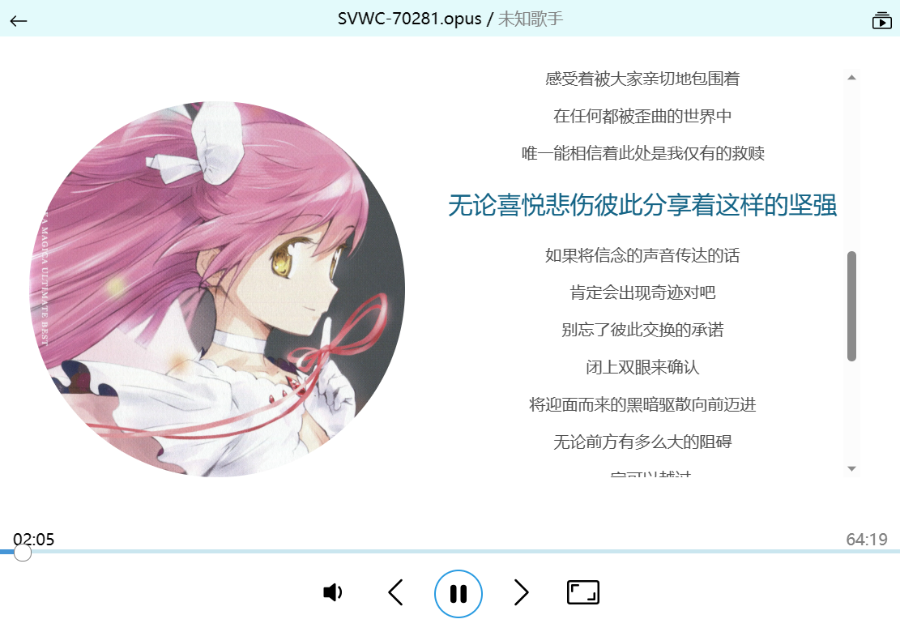
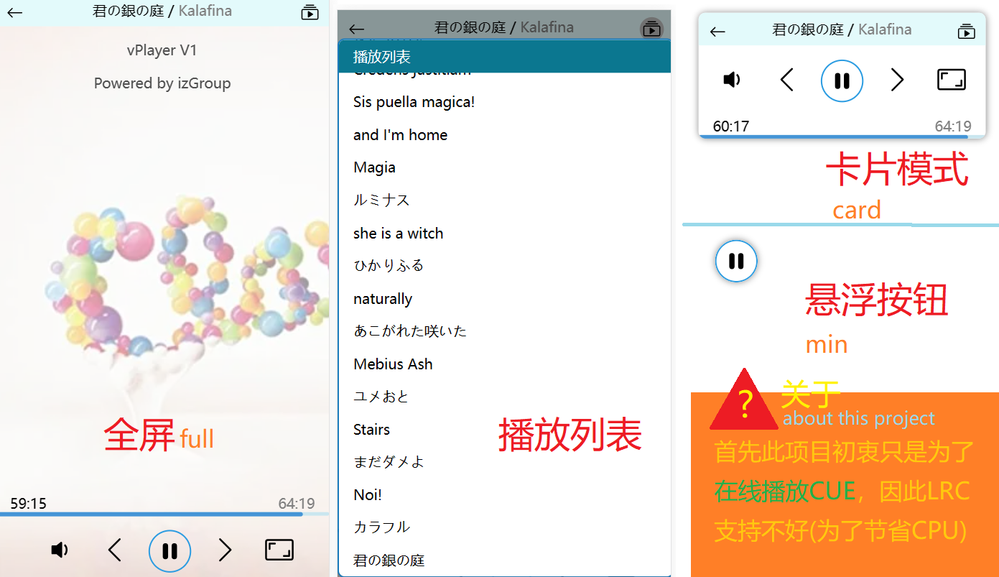

# vPlayer
 - 轻量级播放器，支持3种显示模式
 - 自适应，不占地，支持简单的CUE解析
 - 只需要引入JS文件，无需初始化直接用
 - 不支持跨域，请LRC和CUE都PULL至自己的服务器

## 使用
推送至vPlayer: `$vp.list.push(数据)`
播放/暂停: `$vp.play(01:21[时间]或2[音乐ID]或干脆不填)`
可以参考index.html的示例